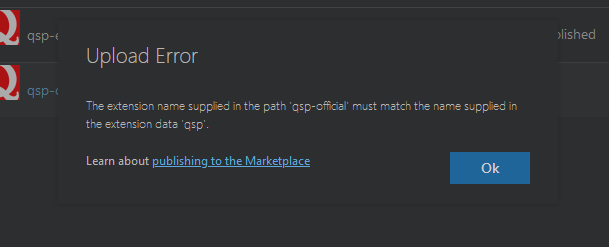

---
tags:
  - расширение для VS Code
  - VS Code Marketplace
  - Qsp.FSharp
authors:
  - fering
---
# Тонкости публикации расширений в VS Code Marketplace

Во время публикации расширения в [VS Code Marketplace](https://marketplace.visualstudio.com/vscode) можно столкнуться с рядом не очевидных (на мой взгляд) трудностей. С ними и будем разбираться.

<!-- truncate -->

## Совпадение `name` и названия расширения в Marketplace

Значение `name` в `package.json` должно совпадать с названием расширения, указанным в [VS Code Marketplace](https://marketplace.visualstudio.com/vscode), иначе случится такое:

*В `name` указано `qsp`, а должно быть `qsp-official`.*

## Переименовывание расширения в Marketplace

Его переименовать невозможно, даже не надейтесь. Вот это один раз заливаете расширение через "New Extension" -> "Visual Studio Code", сервер считывает `name` в `pack
