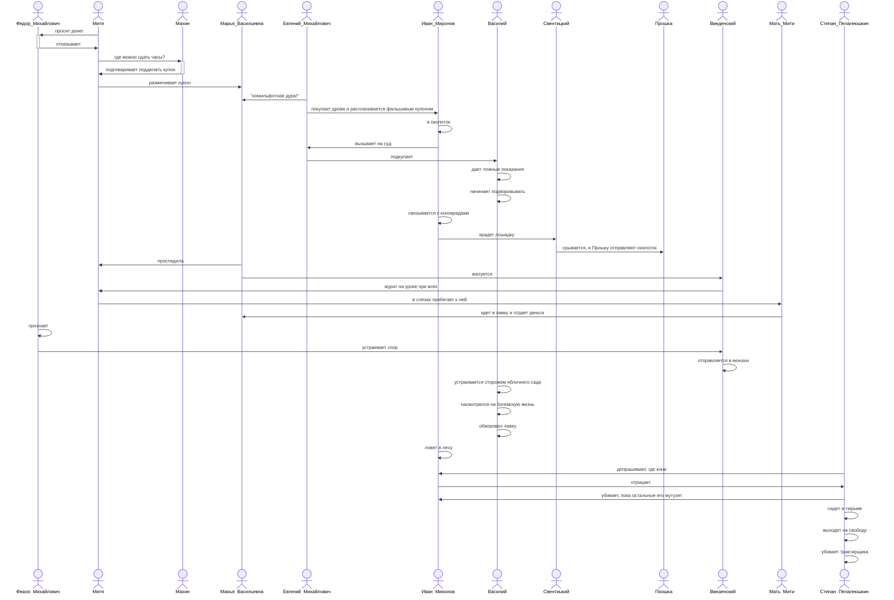

---
tags:
  - Лев Толстой
authors:
  - fering
---
# Фальшивый купон

## Завязка

Честный сын приходит к богатому бате и просит одолжить немного денег, чтобы отдать долг. Батя на него наезжает, обзывает стервятником, мошенником и гонит прочь. От обиды сын действительно решается смошенничать: подделывает купон со своим корешом и разменивает его в местной лавке, чем и запускает цепочку далеко идущих событий.

## Персонажи

* Федор Михайлович Смоковников — председатель верховной палаты, скупердяй
* Митя Федорович Смоковников — гимназист
* Махин — усатый гимназист-щегол
* Марья Васильевна — жена Евгения Михайловича, продавщица фотографических принадлежностей
* Евгений Михайлович — барин, владелец фотографических принадлежностей
* Иван Миронов — крестьянин, возивший на кляче дрова
* Василий — дворник, которого подкупил Евгений Михайлович
* Петр Николаевич Свентицкий — эффективный барин
* Прокофий (Прошка) — случайно подвернувшийся под руку барина
* Введенский — законоучитель Мити, неверующий священник

## Сюжет

Легче представить этот вихрь в Mermaid:

## Забавные обороты и словечки

* Комильфотные гимназисты
* Драч
* Войдя с заднего крыльца в девичью, Иван Миронов перекрестился
* Обындевевшую
* Фатер
* Половому
* Околоточный
* Крытый, отороченный мерлушкой полушубочек
* Человек основательный
* Телеги, сохи, плуги, бороны
* Коровы были тоже своего завода
* Особенно ноской породы куры
* По талому снегу
* Сломанный шкворень
* Произошло горячее объяснение
* Не верить ни в чох, ни в смерть
* Клерикальные влияния
* Стала поспевать грушовка
* С барского гумна принесли солому
* Свистал
* Хозяин попользовался хорошо
* Надели арестантский халат и коты
* Трещал по лучинам

## Источники

* [Само произведение на Викитеке](https://ru.wikisource.org/wiki/Фальшивый_купон_(Толстой))
