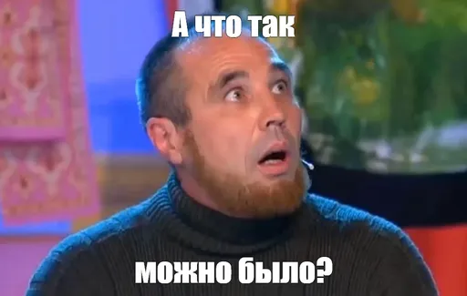

---
tags:
  - обзор
  - ифня
  - instead
authors:
  - fering
---
# Открыть замок, войти в замок: обзор на «Омонимия»

Сходить на косу, скосить косой траву, пострелять из лука, съесть лук, потянуть дверь за ручку и написать ручкой обзор на «Омонимия»!

<!-- truncate -->

Написал игру Luka на конкурс [КРИЛ 2023](https://ifwiki.ru/КРИЛ_2023). В игру можно поиграть на [ifiction.ru](https://forum.ifiction.ru/viewtopic.php?id=2741&lid=13) или в [каталоге INSTEAD](https://instead-games.ru/game.php?ID=387).

## Завязка

Приходим в гости к своему другу, но видим в его доме записку, в которой тот путано объясняется, что куда-то пропал. Он дает напутствие использовать слова и просит уловить *нить* разговора.

Кто мы, где мы, зачем и почему — решительно непонятно, и это будет преследовать, наверное, до конца игры. А всё почему? Потому что геймплей. Лучше начать с него.

## Геймплей

Основная фишка этой игры — это, конечно, геймплей. Он очень необычный. К сожалению, я не помню, как в первый раз вывел для себя его суть (потому что играл где-то в далёком 2023г с соратницей и не оставил никаких заметок). А суть такова — тут можно использовать объекты в нескольких значениях: как предметы и/или как локации.

Видимо, да. Достигается это за счёт [омонимов](https://ru.wikipedia.org/wiki/Омонимы), т.е. слов с виду одинаковых, а по сути разных. Например:

* коса может быть инструментом для скашивания травы, либо прической;
* за́мок — архитектурное сооружение, замо́к — устройство для запирания дверей (технически это — [омограф](https://ru.wikipedia.org/wiki/Омографы), но если убрать ударения, то получится тот же омоним);
* и т.д.

Конечно, идея сразу меня ошарашила. Стало понятно, почему игра заняла первое место — просто за саму идею, что называется. А вот воплощение у нее такое, своеобразное.

Иногда тупо не понимаешь, что игра от тебя хочет. В обычных квестах может случиться ступор мозговины, а с такой механикой затык просто неизбежен. Сидишь со словарем и перебираешь значения слов. Кстати, ни одно значение слова [риф](https://ru.wiktionary.org/wiki/риф) не совпадает с тем, как автор предложил его использовать. Вообще, чисто случайно натыкал, а потом пытался понять, что это было.

Да и в голове вроде как строишь шаблон «использовать объект как предмет и/или локацию», а потом двор (а еще мастерскую) берешь в руки. Каким образом можно взять эту громадину? А еще можно взять обрыв...

Вписываешь двор в качестве локации, а у тебя лес появляется. Я этот прикол постиг только на записи. Во время игры что в первый раз, что во второй долго втыкал от этого прикола в монитор.

Еще там прикол с дробями есть: мол, лежит "1/100 часть", а когда подбираешь ее, то она превращается в дробь. Т.е. идея с омонимами идет лесом.

Повсюду можно брать всё подряд, а в лавке вдруг у ГГ обостряется чувство частной собственности: он заявляет, что за вещи надо платить. Это что за высказывание такое? Буржуазное?

Потихоньку автор выбивает из-под ног понимание игры, а в заключительной части резко меняет геймплей до неузнаваемости. Будто на работу приходишь после учебы, и руководитель тебе говорит: «Забудь, чему тебя там учили — здесь всё будет по-другому». И ты по-новой учишься играть. Такой себе опыт, конечно.

## Пару слов про мир

Мир игры довольно абстрактен. В первой части в письме друга указана река Стикс (и вроде как настраиваешься на древнегреческую волну). Начинаем в какой-то избе без всяких современных удобств (славянские былины?). Сталкиваемся со средневековым замком, вполне себе рабочим и населенным жителями (европейское фэнтези?). Во второй части в мастерской откуда-то появляется электричество (индустриальный век?). А в третей части вообще происходит неописуемая вакханалия (???).

Лично для меня абстрактный мир — это минус, потому что тяжело погрузиться в то, что не понимаешь. Вроде как цепляешься за что-то, а произведение тебя тут же обламывает. Возможно, всему виной причудливый геймплей, к которому тяжело придумать вменяемую конкретику. А может, автор и не думал его делать конкретным. Не знаю.

## Оформление

Игра оформлена красиво. Рисунки (хоть их и мало) выполнены с душой. Просто радуется глаз. Еще стиль такой интересный, будто клинописью нарисовано. Интересное решение использовать фиолетовый цвет на фоне с белым. Не знаю, что тут еще сказать, всё гармонично и хорошо. Дайте два.

## Вывод

Игра точно зайдет тем, кто наигрался в обычные текстовые квесты и хочет попробовать чего-нибудь этакое. Натыкался на [комментарий](https://instead-games.ru/game.php?ID=387#comment-6446112457), призывающий давать поиграть новичкам, но лично я бы не стал. Всё-таки абстракции и дико необычный геймплей может отпугнуть зеленых неофитов.

Сравнивать игру не с чем. Либо у меня мало опыта в текстовых адвенчурах, либо игра, действительно, уникальна в своем геймплее.
