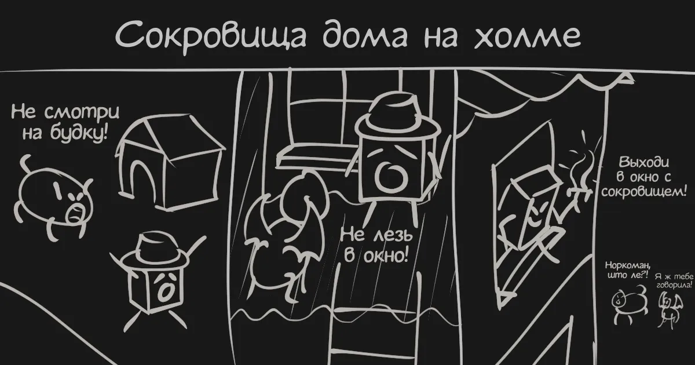

# Сокровища дома на холме (отзыв)

Осматриваем краткое предисловие — ☠️, начинаем сначала. Жмем «подробнее» — ☠️, начинаем читать!

<!-- truncate -->

В игру можно поиграть в [карточке ЗОКи 2026](https://zok.cx/game/3438/).

Играем за вора. Проникаем в дом на холме. Пытаемся вынести сокровища. Но не всё так просто, ведь за каждым углом поджидает смерть... неожиданная! И в этом заключается суть игры: исследуем улицу, осматриваем будку — смерть, начинаем сначала; исследуем дом, заходим не в ту дверь — смерть, начинаем сначала. И так до тех, пока не облазим весь особняк.

Позабавила одна из концовок: когда ГГ хватает трофейный кинжал, он резко и безо всяких предисловий выходит в окно.

Понравилась подсказка про ворона за вуалью. Чуток разбавило привычный цикл игры и заставила включить мозг, пусть и на короткое время.

Игра отлично подойдет как тренажер этой, как её? Памяти, во!
