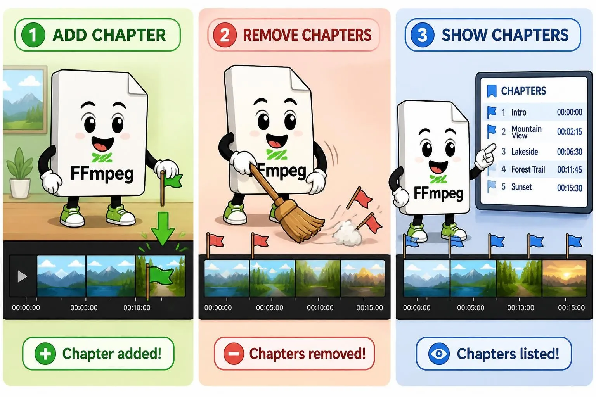

# Таймкоды в медиа



Таймкоды полезны для пользователей. Речь пойдет про добавление их через FFmpeg, считывание, удаление. А еще поговорим совместимости разных форматов.

<!-- truncate -->

## Добавление

Создать файл с таймкодами — `chapters.ini`:

```ini
;FFMETADATA1

[CHAPTER]
TIMEBASE=1/1000
START=0
END=30000 ; 30сек при TimeBase равном 1/1000
title=Вступление

[CHAPTER]
TIMEBASE=1/1000
START=30000 ; 30 сек
END=90000 ; 90 сек
title=Основная часть

[CHAPTER]
TIMEBASE=1/1000
START=90000
END=120000
title=Заключение
```

`ini` он потому, потому что очень похож на его формат.

Запустить FFMpeg:

```bash
ffmpeg -i input.mp4 \
  -i chapters.ini \
  -map_metadata 1 \
  -c copy \
  output.mp4
```

Проверить:

```bash
ffprobe -hide_banner -loglevel error -show_chapters -i output.avi
```

<!-- todo: упрощение формата
* https://github.com/ravexina/ffmpeg-metadata-chapter-generator
* [ffmpeg add chapters to a video without re-encoding using a csv file](https://www.youtube.com/watch?v=O_38IrG0l7g)
-->

## Удаление

```bash
ffmpeg -y -i input.mp4 -c copy -map_chapters -1 output.mp4
```

## Extract

```bash
ffmpeg -i input.mp4 -f ffmetadata ffmetadata.ini
```

Либо через FFprobe:

```bash
ffprobe -hide_banner -loglevel error -show_chapters -i output.avi
```

## Совместимость форматов

Далеко не в каждый формат можно засунуть chapters. В некоторые — можно, но с нюансами.

### AVI

Не сохраняет chapters.

```bash
ffmpeg -i 'работа строителем 2026-10-08 18-33-39-278.avi' \
  -i chapters.ini \
  -map_metadata 1 \
  -c copy \
  output.avi
ffprobe -i output.avi -show_chapters
```

Полная перекодировка тоже не работает:

```bash
ffmpeg -i 'работа строителем 2026-10-08 18-33-39-278.avi' \
  -i chapters.ini \
  -map_metadata 1 \
  output.avi
ffprobe -i output.avi -show_chapters
```

### MP4

Сохраняет chapters.

```bash
ffmpeg -i 'работа строителем 2026-10-08 18-33-39-278.avi' \
  -i chapters.ini \
  -map_metadata 1 \
  output.mp4
ffprobe -i output.mp4 -show_chapters
```

### MP3

Сохраняет chapters.

```bash
ffmpeg -i 'работа строителем 2026-10-08 18-33-39-278.mp3' \
  -i chapters.ini \
  -map_metadata 1 \
  -c copy \
  output.mp3
ffprobe -i output.mp3 -show_chapters
```

MPC-HC v1.7.13 (64-bit) не видит chapters, как AIMP3 v4.60.

### M4A без видео

Сохраняет chapters.

```bash
ffmpeg -i 'работа строителем 2026-10-08 18-33-39-278.avi' \
  -i chapters.ini \
  -map_metadata 1 \
  -vn \
  output.m4a
ffprobe -i output.m4a -show_chapters
```

Воспроизводится в MPC-HC.

Аудио сохраняется в формате AAC.

По размеру чуток уступает MP3, но не критично.

| назв    | размер (байт) |
|---------|---------------|
| M4A     | 3243368       |
| MP3     | 3221642       |
| Разница | 21726         |

<!-- todo: написать вывод -->
